# Приложение для поиска пропавших людей

Данное web-приложение было разработано в качестве итогового проекта на курсе "Deep Learning (семестр 1, весна 2023): продвинутый поток" (https://stepik.org/course/135003).

Для реализации был выбран продуктовый трек.

## 1. Поиск проблемы и описание решения

По данным поисково-спасательного отряда «ЛизаАлерт» каждый год в нашей стране фиксируется
примерно 180 тысяч обращений о пропаже людей. Наибольшее количество заявок связано с поиском
потерявшихся в лесных массивах в период появления грибов. Пытаясь выйти из чащи, человек способен
уйти далеко в любом направлении. Зона поиска может занимать несколько десятков километров.
Поэтому сейчас при поисково-спасательных работах стали применять беспилотные летательные аппараты (БПЛА) для обнаружения пропавших людей в труднодоступных местах — в лесу, на болотах.

Пример обнаружения человека в лесу на снимке с БПЛА:
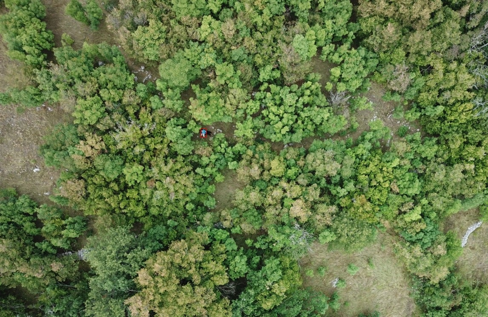

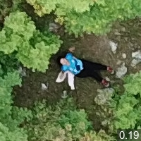

За один день БПЛА способен сделать более 10000 снимков. Эти изображения просматривают
волонтеры, чтобы найти потенциальные признаки присутствия потерявшегося. Как правило для
проработки фотоматериалов одного полета требуется до 30 волонтеров, которые тратят на анализ снимков
около 8 часов драгоценного времени. Примерно через час монотонной работы человеческий глаз устает
и может пропустить важные элементы.

Для облегчения работы волонтеров и повышения шансов на успешный исход поисков
необходимо разработать приложение, которые будет способно автоматически обрабатывать фотоснимки и обнаруживать на них пропавших людей.

### Описание приложения

Решение будет представлять из себя web-приложение состоящее из frontend-а и backend-а. На backend-е будет происходить обработка изображений и запуск моделей. А с использованием frontend-а пользователь сможет загружать изображения для обработки и просматривать результаты работы моделей.

Подобная клиент-серверная архитектура позволяет выполнять запуск моделей на мощном сервере с GPU, при этом пользователю для работы с приложением достаточно слабого ноутбука.

В первой версии приложения должны быть реализованы следующий функции:
- загрузка одного или нескольких изображений на сервер для последующей обработки,
- отображение результатов обработки изображений (информация о найденных людях),
- сохранение загруженных изображений в долговременное хранилище,
- сохранение результатов обработки в долговременное хранилище,
- возможность просмотра сохраненных изображений,
- возможность просмотра сохраненных результатов обработки,
- отображение на карте мест в которых были сделаны фотоснимки.

## 2. Поиск обученной модели и датасета

Особенностью задачи является то, что на вход моделей подаются изображения очень высокого разрешения (например, 8000x6000 пикселей), а люди на этих изображениях занимаю 50-150 пикселей. Таким образом, модель должна уметь хорошо детектировать мелкие объекты на изображении.

В качестве модели для детектированая людей была выбрана предобученная `YOLO8-X`. Она показывает достаточно хорошие результаты детекции и, например, превосходит предобученную `RetinaNet`.

В качестве источника тестовых изображений был выбран датасет HERIDAL: http://ipsar.fesb.unist.hr/HERIDAL%20database.html.

## 3. Выбор фреймворка/библиотеки для разработки веб/мобильного демо

В качестве основы для реализации web-приложения был выбран фреймворк Streamlit (https://streamlit.io/). Он позволяет быстро реализовывать и backend и frontend прямо на питоне.

Для хранения результатов обработки была выбрана БД Sqlite и ORM Peewee (https://github.com/coleifer/peewee).

## 4. Разработка демо

Исходный код приложения находится в данном репозитории.

Приложение состоит из 5 страниц:
- Home - начальная страница
- Detect - загрузка изображений и просмотр результатов
- Journal - просмотр сохраненных изображений и результатов обработки
- Map - отображение результатов обработки на карте
- About - информация о приложении

Скриншот страницы `Detect`:
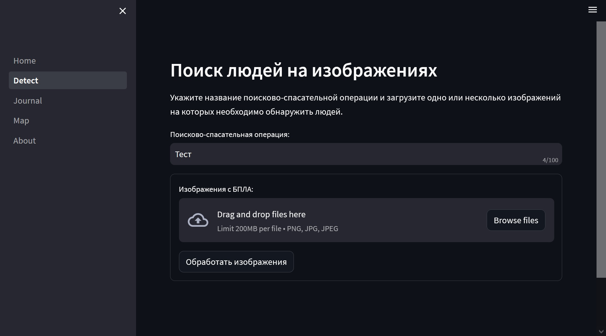

Скриншот страницы `Journal`:
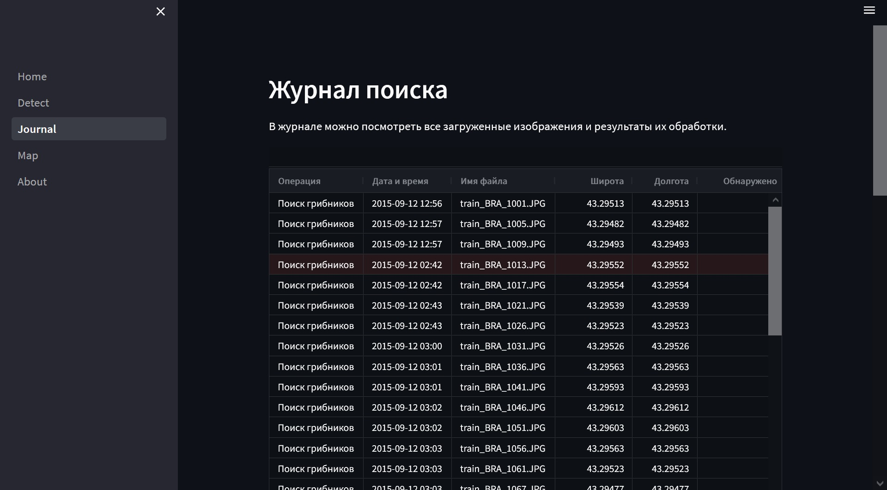

Скриншот страницы `Map`:
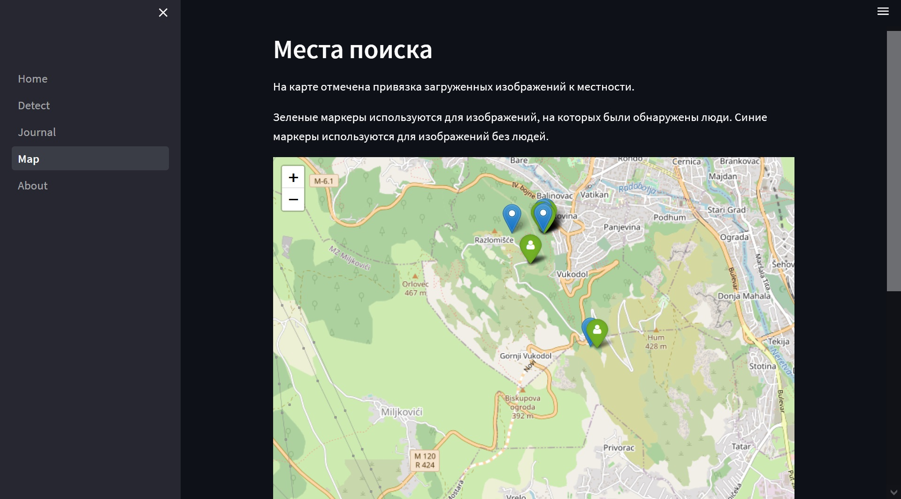

## 5. Встраивание модели-детектора в демо

Встраивание модели YOLO8 в демо было достаточно простым и потребовало написать всего несколько строк кода:

```Python
import ultralytics

model = ultralytics.YOLO('yolov8x.pt')

results = model.predict(source=image, classes=0, verbose=False, ...)
```

## 6. Тестирование демо

Посмотрим на результаты тестирования на изображениях из датасета HERIDAL.

Пример 1:
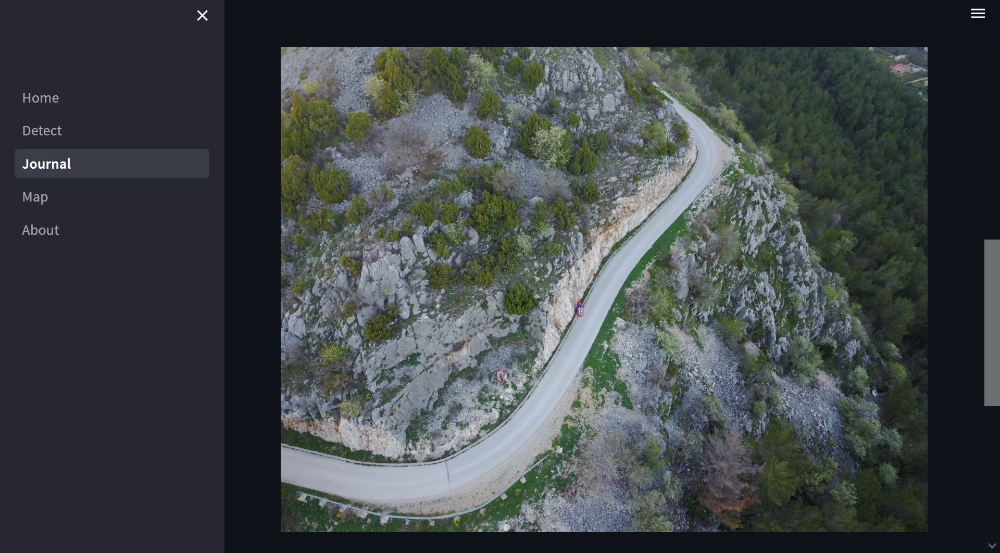

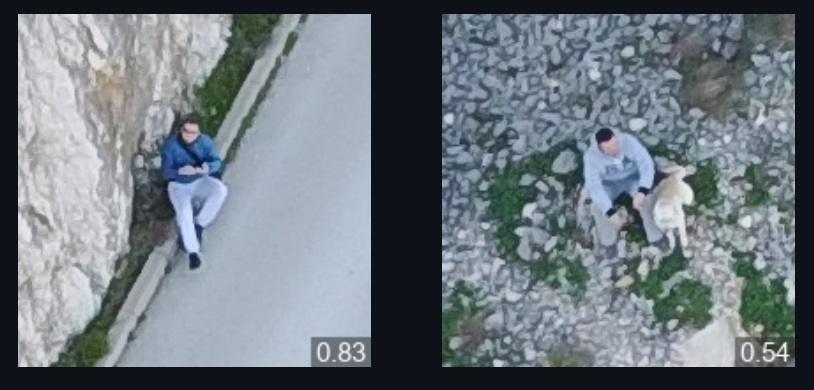

Пример 2:
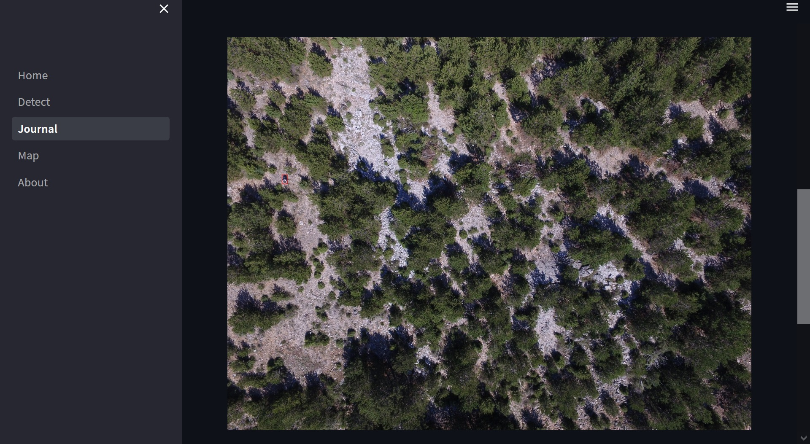

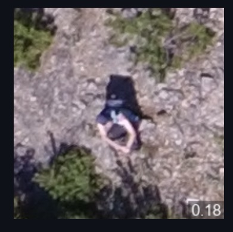

Пример 3:
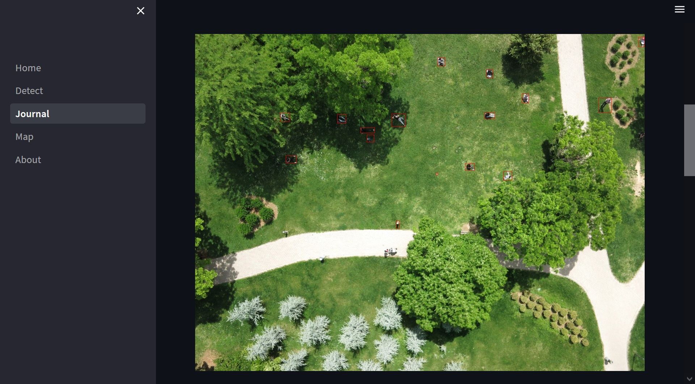

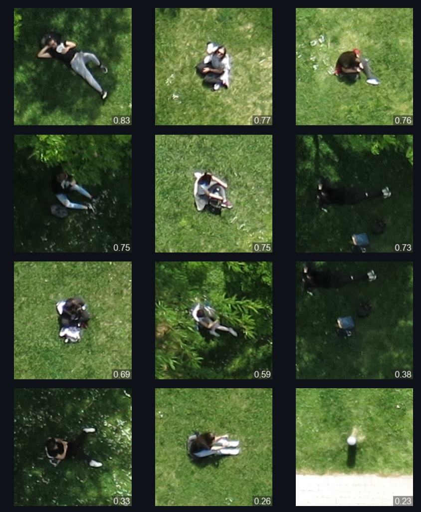

Предобученная модель YOLO8 достаточно неплохо обнаруживает людей с большой высоты. Обнаруживается 70-80% людей на фотографиях, уровень ложно-положительных детектирований около 20%.

Чтобы улучшить результаты необходимо:
- увеличить размер изображений подаваемых на вход модели (для этих примеров использовался размер 1280 пикселей), но это требует кратно больше памяти и времени на обработку изображений;
- разделить исходное изображение на тайлы и обрабатывать каждый тайл по отдельности, но это, опять же, кратно увеличивает время на обработку изображений;
- дообучить модель на наборах фотоснимков с БПЛА, чтобы модель более уверенно обнаруживала мелкие объекты.

## 7. Улучшение дизайна / Развертывание демо на сервере

Приложение было упаковано в Docker-контейнер `diqubit/rescue-app:1.0`.

Для запуска необходимо выполнить команду:
```
docker run -it --rm -p 8501:80 diqubit/rescue-app:1.0
```

И окрыть в браузере страницу `http:\\localhost\`.

## Запуск приложения

### Подготовка окружения

Необходимо создать виртуальное окружение для Python 3.9.16, например:
```
conda create --name=dl-object-detection-spring-2023 python=3.9.16
conda activate dl-object-detection-spring-2023
```

И установить зависимости:
```
python -m pip install -r requirements.txt
```

Приложение можно запустить командой:
```
streamlit run Home.py
```

Предварительно необходимо настроить путь к хранилищу данных в файле настроек `rescue-app.yaml`

## Утилита командной строки

Также была создана утилита командной строки `detect_yolo8.py`, которая позволяет запускать детектор людей.

Использование `detect_yolo8.py`:
```
usage: detect_yolo8.py [-h] [--model MODEL_PATH] [--confidence CONFIDENCE] [--iou IOU] [--image-size IMAGE_SIZE] [--device DEVICE]
                       images_dir output_dir

Detect humans using YOLOv8 model.

positional arguments:
  images_dir            path to the input directory with images
  output_dir            path to the output directory

optional arguments:
  -h, --help            show this help message and exit
  --model MODEL_PATH    path to the model (default: yolov8x.pt)
  --confidence CONFIDENCE
                        confidence treshold (default: 0.1)
  --iou IOU             intersection over union (IoU) threshold for NMS (default: 0.1)
  --image-size IMAGE_SIZE
                        size of input images (default: 1280)
  --device DEVICE       device to run on, i.e. device=cuda or device=0,1,2,3 or device=cpu
```
